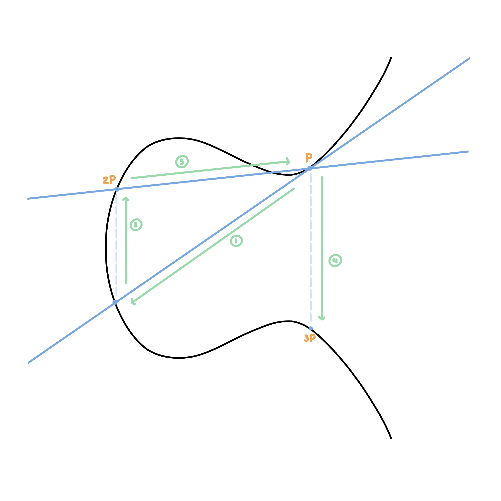

Lors d'une communication sur Internet, les données nécessitent d'être protégées afin d'empêcher qu'elles soient lues par tout le monde. Le protocole HTTPS (Hyper Text Transfer Protocol Secure) se charge de sécuriser les connexions sur Internet, il s'agit d'une version sécurisée de l'HTTP.

Pour être protégées, les données ont besoin d'être chiffrées par l'émetteur et déchiffrées par le destinataire. Pour cela, l'HTTPS utilise le protocole SSL (Secure Socket Layer) ou plus récemment le TLS (Transport Layer Security) qui s'occupe du chiffrement et du déchiffrement sur la couche 5 du modèle OSI.

Nous rappellerons tout d'abord les méthodes utilisées par le TLS/SSL pour chiffrer les données puis nous verrons en quoi les courbes elliptiques garantissent un mode de chiffrement solide, rapide et efficace.

# Le chiffrement selon TLS/SSL

TLS/SSL combine deux types de chiffrement: le chiffrement symétrique et le chiffrement asymétrique.

# Chiffrement symétrique

Il consiste à utiliser la même clé pour le chiffrement et le déchiffrement. Parmi les différentes méthodes de chiffrement symétrique nous retrouvons le code César, le code Vigenère et l’AES (Advanced Encryption Standard). Ce dernier est le code standard pour chiffrer les données sur Internet.

Même s'il garantit un niveau de sécurité élevé, le chiffrement symétrique ne suffit pas en lui-même. En effet, une telle méthode nécessite le passage d'une clé entre l'émetteur du message et le récepteur. Cependant, pour transmettre cette clé de manière sécurisée il faudrait la chiffrer, mais nous aurions alors besoin de transmettre une autre clé et ainsi de suite...

# Chiffrement asymétrique

Ce problème est résolu par un deuxième type de chiffrement: le chiffrement asymétrique. Il consiste à utiliser une clé pour le chiffrement du message et une autre clé pour son déchiffrement. La clé de chiffrement se nomme la clé publique (elle n'a pas besoin d'être gardée secrète, tout le monde doit être capable d'envoyer un message) et la clé de déchiffrement constitue la clé privée (seul le destinataire la connaît et est capable de lire le message). Les deux clés sont liées par une relation mathématique dite asymétrique. Le RSA, du nom de ses créateurs Rivest Shamir Adleman, est un exemple de chiffrement asymétrique qui est utilisé pour le protocole TLS/SSL.

Ce type de chiffrement étant plus coûteux, puisqu'il demande de manipuler des nombres premiers à plusieurs centaines de chiffres, il est seulement utilisé pour échanger la clé du chiffrement symétrique, au début d'une connexion. Le reste de l'échange se fait grâce à un encodage symétrique.

Ce principe est appelé l'échange de clés Diffie-Hellman.

# Limites
Pour être efficace, le RSA a besoin de grands nombres premiers. Les calculs sur ces nombres sont très coûteux et prennent beaucoup d'espace en mémoire. Vient alors la solution des courbes elliptiques.

# Les courbes elliptiques

L'étude des courbes elliptiques n'est pas récente. Elles ont été utilisées dans des domaines variés. Elle n'ont cependant été appliquées que récemment à la cryptographie (introduites en 1985).

Elles possèdent des caractéristiques intéressantes qui peuvent être utiles à la cryptographie asymétrique. Elles sont utilisées notamment pour la signature électronique et l'échange de clé lors du "handshake", c'est-à-dire lors de l'établissement d'une connexion entre deux correspondants.

## Qu'est-ce qu'une courbe elliptique ?

Une courbe elliptique définie sur $\mathbb{R}$ est tout simplement l'ensemble des points qui vérifient l'équation:
$$
y² = x³ + ax + b
$$

avec $a$ et $b$ qui vérifient:
$$
\Delta = 4a³ + 27b² \neq 0
$$
Les courbes elliptiques peuvent avoir des formes variées (selon les valeurs que peuvent prendre a et b):

Quelques caractéristiques intéressantes des courbes elliptiques:

- La courbe est symétrique par rapport à l'axe des abscisses
- Chaque droite qui intersecte la courbe a au plus deux autres intersections avec cette courbe
- Les points de la courbe définissent un corp mathématiques, nous pouvons donc définir les opérations "+", "-" et "/" sur ces points
- On nomme O ou point à l'infini l'élément neutre de l'addition, il se trouve en général aux coordonnées (0, 1)

Nous choisissons deux points $P$ et $Q$ sur la courbe. Pour faire l'addition de ces deux points, il suffit de tracer la droite passant par $P$ et $Q$ puis prendre le troisième point d'intersection $R$  entre la droite et la courbe. Le symétrique de $R$ par rapport à l'axe des abscisses est la somme des deux premiers points:

Si $P = Q$, on trace la tangente en P et on suit le même procédé.

Finalement, si $P = -Q$, la droite est perpendiculaire à l'axe des ordonnées. Il n'y a donc pas de  troisième point d'intersection, on considère alors que que la somme est le point à l'infini O.

Il nous reste maintenant à définir ces opérations de manière algébrique:

Notons $(x_P, y_P)$ et $(x_Q, y_Q)$ les coordonnées respectives de $P$ et $Q$.

Les coordonnées de $S = P + Q$ s'expriment alors:
$$
\begin{align*}
&x_S = \lambda^2 - x_P - x_Q\\
&y_S = \lambda (x_P - x_S) - y_P
\end{align*}
$$

- Si $P = Q$ et $y_P \neq 0$, $\lambda = \frac{3x_P^2 + a}{2y_P}$
- Sinon, $\lambda = \frac{y_Q - y_P}{x_Q - x_P}$

La multiplication est simplement l'addition répétée plusieurs fois:

## Application en cryptologie

Les courbes que nous avons vues précédement sont des courbes continues définies sur $\mathbb{R}$ mais en cryptologie nous avons besoin de manipuler des entiers, et de préférence sur un espace fini. 

Plutôt que de travailler sur des réels, nous allons manipuler des entiers modulo un nombre premier. La courbe devient alors:

[comment]: <> 

Notre courbe est maintenant difficilement reconnaissable mais elle possède bien les mêmes propriétés: symétrie, addition...

L'addition fonctionne toujours de la même façon: on trace une droite passant par deux points puis on trace le symétrique du troisième point rencontré.

Nous notons que nous n'avons plus un corpss défini sur les réels mais un corps cyclique sur $\mathbb{Z} / p\mathbb{Z}*$ ou $p$ représente le nombre premier choisi. Cela signifie que si nous partons d'un point et que nous le multiplions par lui-même assez de fois, nous retomberons sur le même point.

On dit que le groupe $\mathbb{Z}/p\mathbb{Z}$ est d'ordre $p-1$. Ce nombre est important puisqu'il détermine le niveau de sécurité de l'encodage, tout comme la grandeur des nombres premiers pour le RSA. Plus ce nombre est grand, plus le code est fiable.

### Quel est alors le rapport avec la cryptologie asymétrique ?

L'asymétrie des courbes elliptiques repose sur ce principe:

Soit $P$ un point de la courbe et $Q = kP$ un multiple de $P$.

À partir de $P$ et $k$, il est facile de calculer Q. À l'inverse, en partant de $P$ et $Q$ et si l'ordre du groupe est assez grand, il est très difficile de retrouver $k$. Cela revient à résoudre le problème du logarithme discret sur courbe elliptique, qui est plus compliqué à résoudre que le problème du logarithme simple du RSA. 

À longueur de clé égale, l'ECC (Elliptic Curve Cryptography) fournit ainsi une fiabilité supérieure au RSA. Une clé ECC encodée sur 384 bits a une sécurité équivalente à une clé RSA de 7680 bits.

Dans ce système, $k$ représente la clé privée et $P$ et $Q$ la clé publique.

### Algorithme d'échange de clé

Après avoir réussi à reproduire les mêmes propriétés asymétriques que le chiffrement RSA, nous pouvons adapter le principe d'échange de clé de Diffie-Hellman aux courbes elliptiques, c'est ce qu'on appelle l'ECDH (Elliptic Curve Diffie-Hellman).

L'algorithme est le suivant:

- Arielle et Brian se mettent d'accord publiquement sur une courbe elliptique et un point $G$ de cette courbe
- Arielle choisit au hasard un réel $d_A$ et calcule le produit $G_A = d_AG$ qu'elle envoie à Brian (cet échange n'a pas besoin d'être tenu secret)
- De même, Brian choisit un réel $d_B$ et envoie le produit $G_B = d_BG$ à Arielle
-  Finalement, Arielle calcule $S = d_AG_B = d_Ad_BG$ et Brian calcule $S = d_BG_A = d_Ad_BG$

Les deux correspondants se retrouvent ainsi avec la même clé qui peut être utilisée pour un chiffrement symétrique.

# Pour conclure

Le protocole TLS/SSL combine le chiffrement symétrique et le chiffrement asymétrique  afin de garantir la confidentialité des données sur Internet. Le chiffrement symétrique est une solution fiable bien qu'elle ait besoin d'un autre type d'encodage pour assurer une sécurité complète.

RSA a introduit la notion de chiffrement asymétrique et a ainsi permis de sécuriser l'échange de clé au début d'une connexion. Les courbes elliptiques sont une amélioration de ce principe. Les calculs se faisant sur des points et non sur des entiers, cela permet de complexifier la recherche de la clé privée et ainsi d'augmenter la fiabilité de l'encodage.

### Sources

- [math.univ-bpclermont.fr - Courbes elliptiques et cryptographie](http://math.univ-bpclermont.fr/~rebolledo/page-fichiers/projetMichael.pdf)
- [youtube.com - Elliptic Curve Cryptography Overview](https://www.youtube.com/watch?v=dCvB-mhkT0w)
- [lix.polytechnique.fr - Cryptographie Avancée](http://www.lix.polytechnique.fr/~goncalves/Downloads/Cours2_Courbes_elliptiques.pdf)
- [youtube.com - Elliptic Curve Cryptography Tutorial - Understanding ECC through the Diffie-Hellman Key Exchange](https://www.youtube.com/watch?v=gAtBM06xwaw)
- [wikipedia.org - Chiffrement RSA](https://fr.wikipedia.org/wiki/Chiffrement_RSA)
- [cryptobourrin.wordpress.com - Comprendre les courbes elliptiques](https://cryptobourrin.wordpress.com/2018/10/09/comprendre-les-courbes-elliptiques/)
- [websecurity.digicert.com - Que sont SSL, TLS et HTTPS ?](https://www.websecurity.digicert.com/fr/fr/security-topics/what-is-ssl-tls-https)
- [tls.ulfheim.net - The Illustrated TLS Connection](https://tls.ulfheim.net/)

